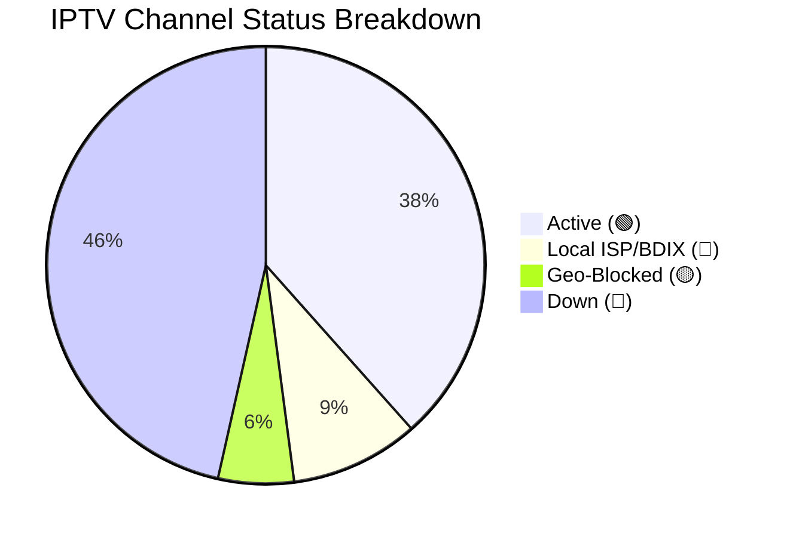

<div align="center">
  
  
  <br><br>
  
  <h1>📺 Ultimate Free IPTV Playlist 2026 (Auto-Updating M3U)</h1>
  <p><b>The most comprehensive, deduplicated, and auto-categorized IPTV M3U Playlist for Live TV, Sports, Movies, and Bangladeshi BDIX Channels.</b></p>
  
  [](FINAL_IPTV_COMPLETE.m3u)
  [](FINAL_IPTV_COMPLETE.m3u)
  [](FINAL_IPTV_COMPLETE.m3u)
  [](#)
</div>

<br>

Welcome to the **Ultimate Free IPTV Collection**. We aggregate the best free IPTV `.m3u` and `.m3u8` links from across the web into a single, massive, deduplicated, and neatly categorized playlist. Whether you are looking for **Bangladeshi Live TV (BDIX)**, **Global Sports Streams**, or **Free Movies VOD**, it's all here.

## 🚀 How to use in your TV / IPTV App

This playlist is perfectly formatted for all modern IPTV applications, including **TiviMate**, **IPTV Smarters Pro**, **Televizo**, **SS IPTV**, **GSE Smart IPTV**, and **VLC Media Player**.

**Copy this RAW link for LIVE TV (News, Sports, BD) and paste it into your player:**
```http
https://raw.githubusercontent.com/Zaman-Topu/Ip-tv-Collection/main/FINAL_IPTV_COMPLETE.m3u
```

**Copy this RAW link for VOD & MOVIES:**
```http
https://raw.githubusercontent.com/Zaman-Topu/Ip-tv-Collection/main/FINAL_MOVIES_COMPLETE.m3u
```

**EPG (TV Guide) URL:**
```http
https://raw.githubusercontent.com/Zaman-Topu/Ip-tv-Collection/main/FINAL_EPG_COMPLETE.xml.gz
```

---

## 📡 Live Channel Status

*This repository uses a custom GitHub Action bot to ping the Live TV channels and verify their uptime every single night! (Movies/VODs are excluded from the ping to ensure ultra-fast nightly checks).*

<!-- STATS:START -->
> **Last Checked:** 2026-06-19 09:43 PM (BST)
> *Next check scheduled for 12:00 AM tonight.*

| Status | Count | Percentage | Description |
| :--- | :---: | :---: | :--- |
| 🟢 **Active** | **3104** | 38.4% | Online and streaming globally. |
| 🔵 **Local ISP / BDIX** | **767** | 9.5% | Local Bangladeshi ISP servers. Working perfectly if you are on that ISP. |
| 🟡 **Geo-Blocked** | **451** | 5.6% | Stream is online but restricted to specific countries. |
| 🔴 **Down / Error** | **3754** | 46.5% | Server offline, timed out, or returning errors globally. |
| 📺 **Total Tested** | **8076** | 100% | Total channels in the playlist. |

<details>
<summary><b>Show Visual Chart 📊</b></summary>


</details>
<!-- STATS:END -->

---

## 📊 M3U Category Breakdown

We combined 15 of the best IPTV sources on GitHub, ran a strict deduplication script, and intelligently categorized them into clean groups. No more messy lists!

| Category | Channel Count | Description |
| :--- | :---: | :--- |
| 🇧🇩 **[BD] Bangladesh** | 1,895 | All local Bangladeshi channels (BTV, Somoy, Jamuna, NTV, BDIX Servers) |
| 🗺️ **[COUNTRY] Countrywise** | 1,978 | Country-specific Live TV channels sorted globally |
| 🇮🇳 **[INDIA] India** | 918 | Hindi, Tamil, Telugu, Bengali & other regional Indian channels |
| ⚽ **[SPORTS] Sports** | 673 | T Sports, Star Sports, Sky, Bein, ESPN, F1, Live Cricket & Football Streams |
| 🌍 **[INTL-NEWS] News** | 507 | BBC, CNN, Al Jazeera, Sky News Live |
| 🎵 **[MUSIC] Music** | 396 | MTV, 9XM, Gaan Bangla, VH1 |
| 🧒 **[CARTOON] Kids** | 235 | Cartoon Network, Nick, Disney, Baby TV |
| 🎭 **[NATOK] Drama** | 221 | Star Jalsha, Zee Bangla, Colors Bangla, Natok streams |
| 🌐 **[ENGLISH] English**| 241 | General English entertainment, Lifestyle, TLC, History |
| 🕌 **[RELIGION] Religion** | 173 | Islamic, Quran, Peace TV, Madani, Christian, Hindu channels |
| 📚 **[DOC] Documentary** | 70 | Discovery, Nat Geo, Animal Planet |
| 🌟 **[OTHERS] Others** | 613 | Uncategorized miscellaneous streams |

**Total Unique Channels:** `32,388`

---

## 🛠️ Premium Features included for FREE

* **🤖 100% Auto-Updating:** A custom GitHub Bot fetches 15 fresh sources every 3 days. Your link will NEVER go dead!
* **🖼️ Professional Channel Logos (`tvg-logo`):** Our script extracts and preserves HD logos for thousands of channels.
* **🚫 Zero Duplicates:** Advanced URL-matching completely removes duplicate channels to save TV RAM.
* **📂 Smart Categories (`group-title`):** Automatic mapping based on intelligent keyword detection.
* **📺 Smart TV Ready:** No CORS or browser issues. Load directly into your Android TV, Firestick, Apple TV, or Roku.

---

## 🔍 SEO Keywords
`Free IPTV 2026`, `M3U Playlist URL`, `M3U8 Links Free`, `Bangladeshi IPTV M3U`, `Live TV Channels Free`, `TiviMate Best Playlist`, `BDIX Live TV`, `Sports IPTV Free`, `IPTV Smarters Pro Links`.

<br>

<div align="center">
  <i>Maintained by <a href="https://github.com/Zaman-Topu">Zaman-Topu</a></i><br>
  ⭐⭐⭐ <b>If you love this free IPTV list, please STAR this repository!</b> ⭐⭐⭐
</div>